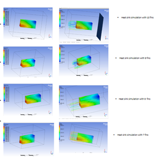

🔗 About Me
________________________________________
Hi, I’m Armaan Bhandari,
A Mechanical Engineer, Problem Solver, and Tech Enthusiast based in Dehradun, India. I’m passionate about understanding the core principles of mechanical engineering and applying them to solve real-world problems. I am particularly keen on integrating advanced technologies into classical mechanical engineering to give it a new edge, pushing the boundaries of what is possible in the field.
Currently, I’m a third-year Mechanical Engineering student at the prestigious Indian Institute of Technology (IIT BHU), Varanasi — an institution with a legacy that stretches back before India’s independence. And I am driven to make a meaningful impact through innovation and problem-solving in the world of engineering.

🔗Projects
________________________________________
🔗Optimization cooling system of PCB Design for Enhanced Electronic Performance:
A project under Associate Professor Dr. Amitesh Kumar
Duration: Jan’24-May’24
Description:
-	Analysed overheating issues in custom-made 200W, 48V BLDC motor controllers and PCBs used in our electric vehicle, optimizing heat dissipation strategies for improved efficiency and reliability.
-	Designed and simulated heat sink configurations using ANSYS Fluent, optimizing fin geometry to enhance cooling efficiency. Conducted thermal analysis of MOSFETs, calculating switching and resistive losses, and identified an optimal 8-fin design for superior heat dissipation.
-	Conducted thermal analysis of the PCB layout using ANSYS Icepak, optimizing airflow and component placement to reduce MOSFET temperatures from 83°C to 57°C. Analysed heat distribution within the PCB casing to enhance cooling efficiency and overall system reliability.
-	The previous motor controller had an efficiency of 86.5%, with MOSFETs identified as critical heat spots due to inadequate airflow and localized overheating. The redesigned controller significantly enhances thermal performance, increasing efficiency from 86.5% to 93.3%, effectively minimizing energy loss and improving overall reliability.
   

                                                            

Fig.1 Thermal image of previous controller                                Fig.2 Heat sink simulation                          

                                                           

Fig.3 Icepak simulation of controller                                   Fig.3 Thermal image of new controller                                   

Improvement :
-	Adequate spacing between MOSFETs enhances airflow, ensuring efficient heat dissipation through convection.
-	Replacing a single gate driver with three separate drivers evenly distributes the thermal load, minimizing localized overheating.
-	Separate ground planes for switching, power, and logic sections reduce thermal coupling, preventing logic devices from overheating.
-	Heat sinks attached to MOSFETs increase heat dissipation, while thermal paste eliminates air gaps, reducing thermal resistance for improved cooling efficiency.

  

